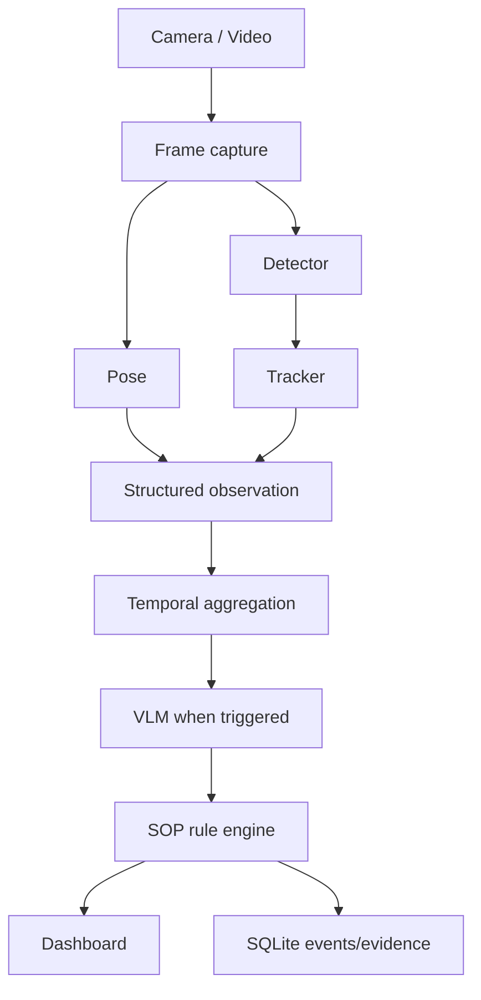
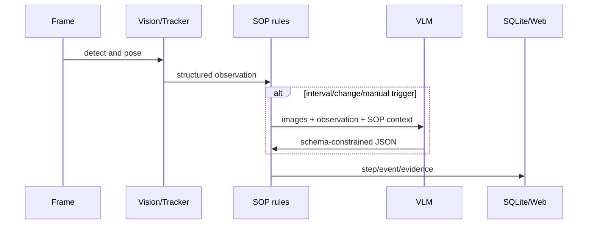

# VLM SOP Monitor

製造・組立・保守作業の映像を、物体検出、姿勢、追跡、時系列ルール、VLMで解析するローカル優先のFastAPIアプリケーションです。既定の`mock`モードはモデル・GPU・外部APIを必要とせず、SOP遷移、SQLite保存、WebSocket、画面を再現します。



## 機能

- 交換可能な YOLO / MediaPipe / IoU追跡アダプターと、ダウンロード不要のモック実装
- 正規化姿勢キーポイント、IoU追跡、移動速度、フレーム・トラック履歴
- YAML SOP、`all` / `any` / `not`、指定の全条件タイプ、継続時間・タイムアウト・前進のみの状態機械
- Mock / OpenAI互換 / Transformers互換VLMプロバイダー。VLMは間隔・検出変化・手動実行時だけ呼出
- FastAPI REST、WebSocket、ブラウザ表示、SQLiteイベント・工程・VLM監査ログ、CSVログ出力
- ブラウザ配信に加えて、サーバー自身によるカメラ／動画ファイル／RTSPストリームの取り込みにも対応
- イベントごとの証拠フレーム（JPEG）保存・取得、セッション履歴API、Prometheus `/metrics`、任意のAPIキー認証・レート制限

## 最短起動（モック）

Python 3.11+ で実行します。

```bash
cp .env.example .env
make install
make dev
```

ブラウザで [http://localhost:8000](http://localhost:8000) を開き、方式（既定はブラウザカメラ）を選んで`開始`を押します。Windowsでは次を直接実行できます。

```powershell
py -m pip install -e ".[dev]"
py -m uvicorn app.main:app --reload --port 8000
```

`GET /health` は `{"status":"ok","mode":"mock"...}` を返します。モック映像は PPE → 工具取得 → 締結 → 完成品配置を順に進めます。

## デモ、テスト、Docker

```bash
make demo       # 疑似動画 data/sample_assembly.mp4 を生成し、60フレームを解析
make test
make lint
docker compose up --build
```

Docker は既定でCPUのモックモードです。GPUを使う場合はCUDA対応イメージ・NVIDIA Container Toolkitをホストに準備し、モデルと環境変数を追加してください。

`main`ブランチへのpushとpull requestでは、GitHub Actions（`.github/workflows/ci.yml`）がPython 3.11・3.12それぞれで`ruff`と`pytest`を実行します。`make lint`はローカルでも同じ内容です。

## API

| API | 内容 |
| --- | --- |
| `GET /health`, `/api/config`, `/api/sops`, `/api/steps` | 稼働・設定・SOP・工程状態 |
| `POST /api/sops/reload` | SOP再読込 |
| `POST /api/session/start` | セッション開始。`source_type`・`source_uri`で映像ソースを指定（後述の「映像ソース」参照）。取り込めない場合は読める`detail`付きの422 |
| `POST /api/session/stop` | セッション停止 |
| `GET /api/session/status` | 進捗、`frames_processed`、`source`（取り込み状況） |
| `GET /api/sessions` | セッション履歴（`limit`/`offset`、各セッションに`event_count`付き、新しい順） |
| `GET /api/sessions/{id}` | セッション詳細、`event_count`、直近20件の`vlm_results` |
| `GET /api/sessions/{id}/events` | セッション別イベント（`limit`/`offset`/`event_type`/`severity`、件数は`X-Total-Count`ヘッダ） |
| `GET /api/events` | イベント一覧（`limit`/`offset`/`event_type`/`severity`/`since`/`session_id`/`all_sessions`、件数は`X-Total-Count`ヘッダ） |
| `GET /api/events/{id}` | イベント詳細 |
| `GET /api/events/{id}/frame` | イベントの証拠フレーム（JPEG）。未保存なら404 |
| `GET /api/events/download` | CSVログ（`frame_path`列を含む） |
| `POST /api/analyze/image`, `/api/analyze/video` | 画像／動画入力（mockで決定的解析） |
| `POST /api/vlm/analyze` | 手動VLMトリガー |
| `GET /api/stream`, `/api/ws` | SSE と WebSocket 結果 |
| `GET /metrics` | Prometheusテキスト形式のメトリクス |

WebSocket は `frame_result`、タイムスタンプ、FPS、objects、poses、current_step、recent_events、vlm_resultを送信します。`recent_events`および`GET /api/events`系のイベントは、証拠フレームが保存されていれば`frame_path`を含みます。

## 映像ソース

`POST /api/session/start`の`source_type`は次の値を受け付けます。

| `source_type` | 内容 |
| --- | --- |
| `mock`（既定） | 内蔵の合成デモ映像。モデル・カメラ不要 |
| `browser` | ブラウザが`/api/analyze/image`へフレームを送信します。レガシー値の`camera`・`video`は`browser`の別名として引き続き使え、応答の`source_type`は`browser`になります |
| `server_camera` | サーバー自身がローカルWebカメラを開きます。`source_uri`はデバイス番号の文字列（例: `"0"`） |
| `file` | サーバー自身が動画ファイルを読み込みます。`source_uri`はリポジトリの`./data`ディレクトリに限定されるパスで、相対パスは`./data`基準で解決され、それ以外を指すパスは422で拒否されます |
| `rtsp` | サーバー自身が`rtsp://`・`rtsps://`・`http://`・`https://`で始まるストリームURLを読み込みます |

`server_camera`・`file`・`rtsp`（サーバー側の取り込み）はセッション開始と同時に始まり、`file`はファイル終端でセッションを自動停止します（設定で無効化しない限りループはしません）。キャプチャは専用の非同期スレッドで動作し、破棄先入れ（drop-oldest）の有界バッファでフレームを解析ループへ渡すため、解析がカメラより遅くても古いフレームが捨てられるだけでレイテンシが蓄積しません。接続に失敗した場合は`source.reconnect_seconds`間隔・`source.max_reconnect_attempts`回（`0`は無制限）でバックオフ再接続します。開けないカメラや見つからないファイルは、セッション開始時点で読める`detail`付きの422として返ります。取り込み状況（`opened`／`finished`／`frames_read`／`frames_dropped`／`reconnects`／`last_error`）は`GET /api/session/status`の`source`と、ダッシュボードの「ライブ解析」パネルで確認できます。既定の方式は`source.type`（環境変数`SOURCE_TYPE`）で設定できますが、`POST /api/session/start`に渡した`source_type`が優先されます。

## 証拠フレーム

`storage.save_event_frames`（環境変数`SAVE_EVENT_FRAMES`、既定で有効）を有効にすると、記録されたイベントごとにJPEGスナップショットが保存され、`GET /api/events/{id}/frame`で取得できます（保存されていないイベントには404）。画質は`storage.frame_jpeg_quality`（`FRAME_JPEG_QUALITY`）、最大辺は`storage.frame_max_dim`（`FRAME_MAX_DIM`）、保存先は`storage.frame_dir`（`FRAME_STORAGE_DIR`）で調整します。フレームも保持期間の対象で、`storage.retention_days`を過ぎると他の記録と一緒に削除されます。ダッシュボードのイベント一覧では、証拠フレームがあるイベントに遅延読み込みのサムネイルを表示します。

## SOP作成

`sop/example_assembly.yaml`を複製して、`steps`、`regions`、必要物体を編集します。各stepは`minimum_duration_seconds`と`timeout_seconds`を指定でき、対応条件は`object_present`、`object_absent`、`object_count`、`object_inside_region`、`object_near_object`、`object_near_body_part`、`body_part_inside_region`、`pose_angle`、`hand_object_interaction`、`duration`、`step_completed`、`vlm_confirmation`です。複合条件は`all`、`any`、`not`です。

`vlm_confirmation`はキャッシュされたVLM結果の鮮度も見ます。既定では`vlm.max_result_age_seconds`（環境変数`VLM_MAX_RESULT_AGE_SECONDS`、既定15秒）より古い結果は工程を確定させず、条件は`stale`な理由とともに不成立になります。条件ごとに`max_age_seconds`を指定すると、この既定値を上書きできます。

## 実モデルとVLM

`APP_MODE=full`、`DETECTION_MODEL_PATH`、`POSE_MODEL_PATH`を設定し、必要な任意依存を導入します。

```bash
pip install -e '.[vision,local-vlm]'
VLM_PROVIDER=openai_compatible VLM_MODEL=... VLM_BASE_URL=https://... VLM_API_KEY=... make dev
```

`VLM_PROVIDER=mock|openai_compatible|local`で切替できます。OpenAI互換プロバイダーはフレーム画像をbase64 JPEGとしてvision形式で送信します。VLM呼出はバックグラウンドで実行されるためフレーム処理を停止させず、結果は完了後のフレームに反映されます（`POST /api/vlm/analyze`は同期実行で最新結果を返します）。`VLM_TIMEOUT_SECONDS`、`VLM_MAX_RETRIES`（429/5xx/ネットワークエラーのみ再試行）、`VLM_JPEG_QUALITY`、`VLM_IMAGE_MAX_DIM`、`VLM_MIN_TRIGGER_GAP_SECONDS`（検出変化トリガーの最小間隔）、`VLM_FAILURE_BACKOFF_SECONDS`（失敗後の自動呼出抑制）で調整できます。日常動作モードではVLMの判定を優先し、失敗・不明時はローカル姿勢推定へフォールバックします。APIキーはログや`/api/config`に露出しません。Transformersはモデル固有のchat template差異が大きいため、`app/vlm/local_provider.py`にデプロイ対象モデルのアダプターを追加してください。安全上重要な判定はVLM単独では確定しません。

実検出のラベルをSOPの物体名へ対応付けるには、`config/default.yaml`の`vision.class_aliases`を設定します。

```yaml
vision:
  class_aliases:
    hard_hat: helmet
    phillips_driver: screwdriver
```

`full` と `vision-only` は検出モデルが未設定・未配置なら起動時に明確な設定エラーを返します。`vlm-only` は空の視覚観測を使うため、モック物体検出による誤ったSOP完了を発生させません。



## ディレクトリ

`app/vision` は推論、`app/sop` はルール・状態、`app/vlm` はVLM、`app/storage` はSQLite、`app/services` は統合、`templates`/`static` はUI、`tests` は外部依存なしのテストです。

## 監視とAPI保護

- `GET /metrics`はPrometheusテキスト形式（`text/plain; version=0.0.4`）で、`vlmsop_`接頭辞のメトリクス（`vlmsop_build_info`、`vlmsop_frames_processed_total`、`vlmsop_vlm_calls_total`、`vlmsop_session_active`、`vlmsop_events_total`など）を公開します。イベントの内訳は`vlmsop_events_by_type{event_type="..."}`と`vlmsop_events_by_severity{severity="..."}`の別系列として公開され、合計値と二重計上されません。
- `security.api_key`（環境変数`API_KEY`、既定は空で無効）を設定すると、`/api/*`配下と`/metrics`のすべてのパスで`X-API-Key: <key>`または`Authorization: Bearer <key>`が必須になります。`/health`、`/`、`/static`は引き続き公開のままです。WebSocket（`/api/ws`）はヘッダーまたは`?api_key=`クエリパラメータでキーを受け付けます。**同梱のダッシュボードはこのキーを送信しません**。`API_KEY`はAPIクライアント向けの機能であり、ダッシュボードと併用する場合はリバースプロキシやブラウザ拡張機能でヘッダーを付与する必要があります。
- `security.rate_limit_per_minute`（環境変数`RATE_LIMIT_PER_MINUTE`、既定`0`で無効）で、クライアントごとに1分あたりのリクエスト数を制限できます。

## セキュリティとプライバシー

- OpenAI互換VLMでは映像・観測情報が指定APIへ送信され得ます。ローカルVLMなら外部送信を避けられます。
- APIキーは環境変数で渡し、Gitやログに置きません。
- アップロードはサイズ・拡張子・MIMEを制限し、受信ファイル名を保存パスに使いません。`file`ソースの動画パスはリポジトリの`./data`配下に限定されます。
- 任意のAPIキー認証（`API_KEY`）とレート制限（`RATE_LIMIT_PER_MINUTE`）を用意していますが、既定では無効です（詳細は「監視とAPI保護」参照）。本番ではこれに加えてTLS終端、認可、マルウェア検査などをリバースプロキシ等で追加してください。顔・人物映像には同意、最小化、保持期間、関連法令の確認が必要です。
- `storage.retention_days`（環境変数`RETENTION_DAYS`）は起動時に適用され、保持期間を過ぎたイベント・証拠フレーム・VLM監査ログ・工程結果・（実行中でない）セッションをSQLiteから削除します。`0`以下で無効化できます。`storage.retention_interval_minutes`（環境変数`RETENTION_INTERVAL_MINUTES`、既定60分）ごとに同じ削除を定期実行もします（`0`以下なら起動時のみ）。イベントフレーム保存とあわせて運用ポリシーに合わせて設定してください。
- VLMが`safety_violation`を報告すると、重大度`CRITICAL`の`safety_violation`イベントを記録します（同一違反内容はセッション内で重複記録しません）。ダッシュボードとCSVログに重大度付きで表示されます。
- タイムスタンプはすべてUTCで保存されます。SQLiteはWALモード（`journal_mode=WAL`）で動作し、セッションID・タイムスタンプ・イベント種別の列にインデックスを付与しています。旧バージョンが書き込んだ行はマシンのローカルオフセットで保存されていたため、そうした既存データベースでは保持期間の比較が実行マシンのUTCオフセット分ずれることがあります（新規に作成したデータベースでは正確です）。

## ライセンス上の注意

このリポジトリのコードはMITです。FastAPI、Pydantic、NumPy、PyYAML、SQLAlchemy、OpenCV、Ultralytics、MediaPipe、ONNX Runtime、Transformers、および任意のモデル重み・学習データはそれぞれ別のライセンス／利用条件を持ちます。特にUltralyticsのコード・YOLO重み、Transformersモデル重み、学習データ由来の制約は、商用利用可否を本READMEで保証しません。導入する各バージョン・重み・データセットのライセンス、配布条件、特許・地域制限を使用者自身が最終確認してください。交換可能なアダプター設計は特定モデルへのライセンスロックインを避けるためのものです。

## 既知の制約・今後

モック動画は検証用の図形です。実運用には対象工具・部品に合わせた検出モデル、カメラ校正、複数人物の関連付け、実動作の時系列分類、SQLAlchemy/Alembicによる運用DB移行を追加してください。任意のAPIキー認証・レート制限・`/metrics`は用意していますが、本番運用に足る認可・監査・アラートは別途構築が必要です。単一画像は動作を確定できないため、工程の確定は継続時間と追跡に基づきます。

- 日常動作モードの人物解析は試験実装です。現在の工場向け検出重みは人物以外のラベルを日常動作モードから除外しますが、人物検出・姿勢推定の精度、遮蔽時の追跡、歩行や着座などの動作分類は未検証であり、実運用判定には使用できません。

### トラブルシューティング

- モデル未配置: `APP_MODE=mock`へ戻すか、モデルパスと任意依存を確認します。
- GPUなし: `VISION_DEVICE=cpu`または`auto`を設定します。
- VLM失敗: `VLM_PROVIDER=mock`で映像・SOP処理は継続します。
- ポート競合: `APP_PORT=8001 uvicorn app.main:app --port 8001`を実行します。
