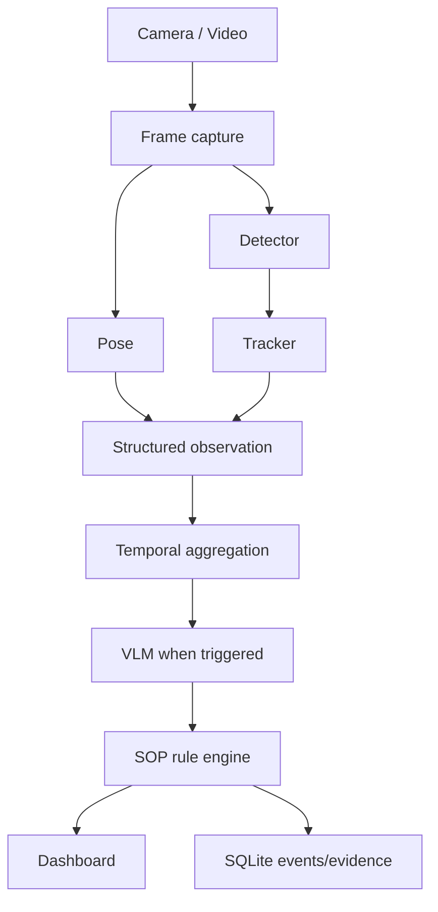
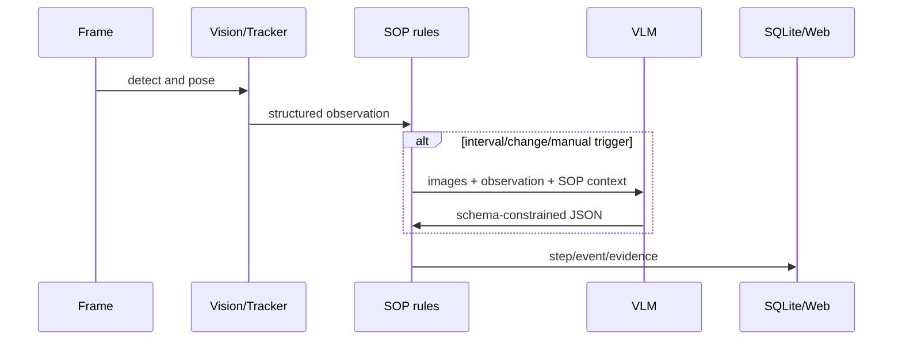

# VLM SOP Monitor

製造・組立・保守作業の映像を、物体検出、姿勢、追跡、時系列ルール、VLMで解析するローカル優先のFastAPIアプリケーションです。既定の`mock`モードはモデル・GPU・外部APIを必要とせず、SOP遷移、SQLite保存、WebSocket、画面を再現します。



## 機能

- 交換可能な YOLO / MediaPipe / IoU追跡アダプターと、ダウンロード不要のモック実装
- 正規化姿勢キーポイント、IoU追跡、移動速度、フレーム・トラック履歴
- YAML SOP、`all` / `any` / `not`、指定の全条件タイプ、継続時間・タイムアウト・前進のみの状態機械
- Mock / OpenAI互換 / Transformers互換VLMプロバイダー。VLMは間隔・検出変化・手動実行時だけ呼出
- FastAPI REST、WebSocket、ブラウザ表示、SQLiteイベント・工程・VLM監査ログ、CSVログ出力

## 最短起動（モック）

Python 3.11+ で実行します。

```bash
cp .env.example .env
make install
make dev
```

ブラウザで [http://localhost:8000](http://localhost:8000) を開き、`カメラ開始`を選びます。Windowsでは次を直接実行できます。

```powershell
py -m pip install -e ".[dev]"
py -m uvicorn app.main:app --reload --port 8000
```

`GET /health` は `{"status":"ok","mode":"mock"...}` を返します。モック映像は PPE → 工具取得 → 締結 → 完成品配置を順に進めます。

## デモ、テスト、Docker

```bash
make demo       # 疑似動画 data/sample_assembly.mp4 を生成し、60フレームを解析
make test
make lint
docker compose up --build
```

Docker は既定でCPUのモックモードです。GPUを使う場合はCUDA対応イメージ・NVIDIA Container Toolkitをホストに準備し、モデルと環境変数を追加してください。

## API

| API | 内容 |
| --- | --- |
| `GET /health`, `/api/config`, `/api/sops`, `/api/steps` | 稼働・設定・SOP・工程状態 |
| `POST /api/sops/reload` | SOP再読込 |
| `POST /api/session/start`, `/api/session/stop` | セッション制御 |
| `GET /api/session/status`, `/api/events`, `/api/events/{id}` | 進捗と監査記録 |
| `POST /api/analyze/image`, `/api/analyze/video` | 画像／動画入力（mockで決定的解析） |
| `POST /api/vlm/analyze` | 手動VLMトリガー |
| `GET /api/stream`, `/api/ws` | SSE と WebSocket 結果 |
| `GET /api/events/download` | CSVログ |

WebSocket は `frame_result`、タイムスタンプ、FPS、objects、poses、current_step、recent_events、vlm_resultを送信します。

## SOP作成

`sop/example_assembly.yaml`を複製して、`steps`、`regions`、必要物体を編集します。各stepは`minimum_duration_seconds`と`timeout_seconds`を指定でき、対応条件は`object_present`、`object_absent`、`object_count`、`object_inside_region`、`object_near_object`、`object_near_body_part`、`body_part_inside_region`、`pose_angle`、`hand_object_interaction`、`duration`、`step_completed`、`vlm_confirmation`です。複合条件は`all`、`any`、`not`です。

## 実モデルとVLM

`APP_MODE=full`、`DETECTION_MODEL_PATH`、`POSE_MODEL_PATH`を設定し、必要な任意依存を導入します。

```bash
pip install -e '.[vision,local-vlm]'
VLM_PROVIDER=openai_compatible VLM_MODEL=... VLM_BASE_URL=https://... VLM_API_KEY=... make dev
```

`VLM_PROVIDER=mock|openai_compatible|local`で切替できます。APIキーはログや`/api/config`に露出しません。Transformersはモデル固有のchat template差異が大きいため、`app/vlm/local_provider.py`にデプロイ対象モデルのアダプターを追加してください。安全上重要な判定はVLM単独では確定しません。

実検出のラベルをSOPの物体名へ対応付けるには、`config/default.yaml`の`vision.class_aliases`を設定します。

```yaml
vision:
  class_aliases:
    hard_hat: helmet
    phillips_driver: screwdriver
```

`full` と `vision-only` は検出モデルが未設定・未配置なら起動時に明確な設定エラーを返します。`vlm-only` は空の視覚観測を使うため、モック物体検出による誤ったSOP完了を発生させません。



## ディレクトリ

`app/vision` は推論、`app/sop` はルール・状態、`app/vlm` はVLM、`app/storage` はSQLite、`app/services` は統合、`templates`/`static` はUI、`tests` は外部依存なしのテストです。

## セキュリティとプライバシー

- OpenAI互換VLMでは映像・観測情報が指定APIへ送信され得ます。ローカルVLMなら外部送信を避けられます。
- APIキーは環境変数で渡し、Gitやログに置きません。
- アップロードはサイズ・拡張子・MIMEを制限し、受信ファイル名を保存パスに使いません。
- 本番では認証、認可、TLS、レート制限、マルウェア検査を追加してください。顔・人物映像には同意、最小化、保持期間、関連法令の確認が必要です。
- `storage.retention_days`とイベントフレーム保存は運用ポリシーに合わせて設定してください。

## ライセンス上の注意

このリポジトリのコードはMITです。FastAPI、Pydantic、NumPy、PyYAML、SQLAlchemy、OpenCV、Ultralytics、MediaPipe、ONNX Runtime、Transformers、および任意のモデル重み・学習データはそれぞれ別のライセンス／利用条件を持ちます。特にUltralyticsのコード・YOLO重み、Transformersモデル重み、学習データ由来の制約は、商用利用可否を本READMEで保証しません。導入する各バージョン・重み・データセットのライセンス、配布条件、特許・地域制限を使用者自身が最終確認してください。交換可能なアダプター設計は特定モデルへのライセンスロックインを避けるためのものです。

## 既知の制約・今後

モック動画は検証用の図形です。実運用には対象工具・部品に合わせた検出モデル、カメラ校正、複数人物の関連付け、実動作の時系列分類、認証・監視、SQLAlchemy/Alembicによる運用DB移行を追加してください。単一画像は動作を確定できないため、工程の確定は継続時間と追跡に基づきます。

- 日常動作モードの人物解析は試験実装です。現在の工場向け検出重みは人物以外のラベルを日常動作モードから除外しますが、人物検出・姿勢推定の精度、遮蔽時の追跡、歩行や着座などの動作分類は未検証であり、実運用判定には使用できません。

### トラブルシューティング

- モデル未配置: `APP_MODE=mock`へ戻すか、モデルパスと任意依存を確認します。
- GPUなし: `VISION_DEVICE=cpu`または`auto`を設定します。
- VLM失敗: `VLM_PROVIDER=mock`で映像・SOP処理は継続します。
- ポート競合: `APP_PORT=8001 uvicorn app.main:app --port 8001`を実行します。
